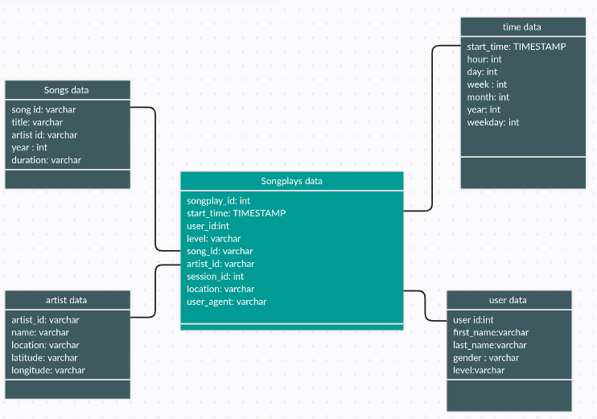

# Data Modeling with Postgres
## Introduction 
Sparkify is a startup that collected data about songs and their users on the newly developed mobile app. The data scientist team need to understand the data and present it better. The data was gathered into multiple json files and directories. An ETL pipeline will work on Postgrs database and Python to come up with an effective database the optimizes the queries. 

## Project Objectives 
The main objectives for this project is to create an ETL pipeline that will;
* Enable the analytics team to analyse and interpret the data easily. 
* Enable the end-user to query data easily. 

## Project Requirements
Your computer need to be installed with the following to work on this project successfully;
* Python
* Jupyter Notebook
* Postgres

The following python libraries need to be installed;
 * psycopg2-binary

This is installed by running ```pip install psycopg2-binary``` on the terminal. 

* Pandas and numpy

Can be installed by running ```pip install pandas``` and ```pip install numpy``` on the terminal respectively. 

## Project Description 
There were two datasets in this project, namely;
* Song dataset
* Log dataset

### Song Dataset 
This dataset consists of multiple json files in the song_data directory. It contains data about specific songs and their artists.The first three letters of each song's track ID describe their location. For instance, here are filepaths to one files in this dataset.

```data/song_data/A/B/C/TRABCEI128F424C983.json```

### Log Dataset
This is the data gathered from the end user activity on the streaming app. It contains data about the user and their activity on the app. The directories are named according to dates and years the activities took place. For instance one of the json filepath is 
```data/log_data/2018/11/2018-11-13-events.json```

## Database Structure 
The UML diagram below was designed by the data science teams to plan and explain how the final database will work



## The Pipeline
The ETL pipelinea will process the two file types; the log file which stores the user activity and information, and the song file that stores the songs data. 

The databases and the tables were generated by running ```python create_tables.py``` or ```python3 create_tables.py```

then the `etl.py` file was executed to perform the entire ETL process; processing both log and song files. The following command was run at the terminal 
```
python etl.py
```
 
 *You can replace 'python3' with 'python' if it fails to work*